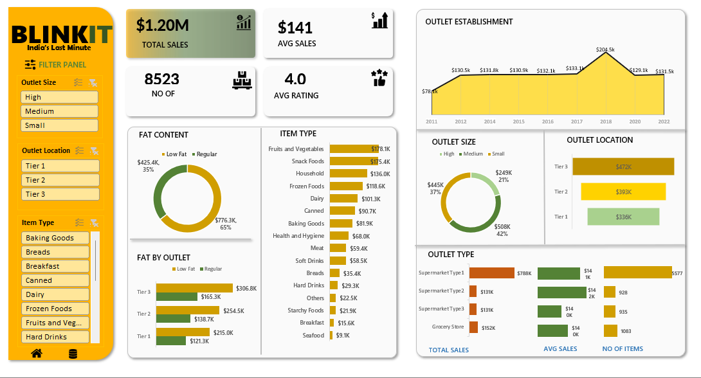

# Blinkit
Data dashboard for Blinkit India to analyze outlet performance, sales distribution, and product category trends. Built with Power BI, this dashboard empowers stakeholders to drive inventory, outlet, and product strategy with data.

# 💼 Blinkit Outlet & Sales Analysis

**A visual analytics project to monitor sales trends, outlet characteristics, and category-level performance for Blinkit — India’s last-minute grocery delivery platform.**

---

## 🧭 Project Overview

Blinkit operates a rapid delivery network across India with varied outlet sizes, locations, and product offerings. To optimize business performance, the company needed clarity on:

- 🛍️ Sales by item type and fat content  
- 🏬 Performance by outlet size, type, and location  
- 📊 Trends in outlet establishment and inventory dynamics

This dashboard provides key insights using transactional and operational data from Blinkit’s network.

---

## 🎯 Objectives

- Understand **sales performance** by outlet characteristics  
- Analyze **product category contribution** to overall sales  
- Explore impact of **fat content** on product sales  
- Track **outlet expansion trends** and performance over time  

---

## 📘 Data Dictionary

| Feature           | Description                                     | Type        |
|-------------------|-------------------------------------------------|-------------|
| Outlet Size        | Size category of outlet (High, Medium, Small)   | Categorical |
| Outlet Location    | Geographic tier (Tier 1, Tier 2, Tier 3)        | Categorical |
| Item Type          | Product categories (e.g., Dairy, Snacks)        | Categorical |
| Fat Content        | Low Fat or Regular                              | Categorical |
| Total Sales        | Aggregated sales in USD                         | Numeric     |
| No of Items        | Count of unique items sold                      | Numeric     |
| Avg Sales          | Average sale per item/outlet                    | Numeric     |
| Rating             | Customer rating (scale of 1–5)                  | Numeric     |
| Establishment Year | Year outlet was established                     | Date        |
| Outlet Type        | Format of store (e.g., Supermarket Type 1)      | Categorical |

---

## 📊 Key Insights

- 🥇 **Fruits & Vegetables** lead in item-type sales with **$178.1K**, followed by **Snack Foods ($175.4K)**  
- 🧈 Regular fat products account for **65% of sales ($776.3K)**; Low Fat accounts for the remaining 35%  
- 🏬 **High-size outlets** contribute the most to sales (**$508K**, 42% of total)  
- 📍**Tier 3 locations** lead by sales volume ($472K), despite perceptions of lower economic activity  
- 🏢 Most outlets were established post-2012, with peak sales in **2018 ($204.5K)**

---

## 📈 Dashboard Highlights

Power BI dashboard includes:

- 💰 **Total Sales:** $1.20M  
- 🛒 **Item Breakdown:** Sales by item type, fat content  
- 🏪 **Outlet Performance:** Sales by outlet size, type, and location  
- 📆 **Establishment Trend:** Annual outlet performance from 2011–2022  
- 📦 **Fat Content by Tier:** Sales split by fat content per outlet tier  
- 📌 **KPIs:** Avg sales per outlet ($141), Avg rating (4.0), No. of unique items (8523)

> 📷 

---

## 🛠 Tools & Techniques

- **Power BI:** End-to-end dashboard development  
- **DAX:** Custom KPIs and calculated fields  
- **Excel/CSV:** Data cleaning and transformation  
- **Design Thinking:** Focus on interactivity, filter panels, and comparative charts

---

## ✅ Recommendations

1. 📦 Promote **low-fat alternatives** in Tier 1 & 2 outlets to balance the health-driven demand  
2. 📊 Focus investment in **Snack Foods & Household items** which are under-optimized categories  
3. 🏬 Consider scaling **Supermarket Type 1** format across new high-potential locations  
4. 🧭 Revisit expansion strategy post-2018 due to declining trend in new outlet sales  

---

## 🚀 Business Impact

The dashboard enables Blinkit to:

- 📍 Identify **top-performing locations** and outlet types  
- 📦 Optimize **product inventory** based on item category performance  
- 🛠 Align **resource allocation** with sales trends and market demand  
- 📉 Reduce waste by analyzing fat content demand trends across tiers

---

## 🧠 Personal Reflection

This project helped me grow in:

- Translating operational data into executive insights  
- Designing **user-centric dashboards** with actionable filters  
- Applying data storytelling for real-time retail strategy  
- Mastering Power BI visuals and interactivity for stakeholder reports

